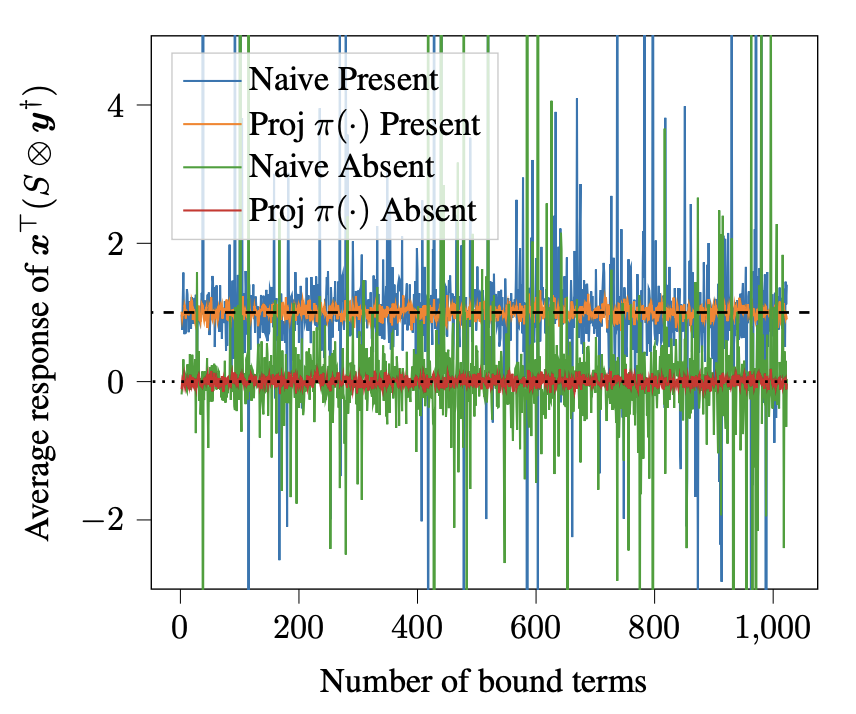

## [Learning with Holographic Reduced Representations](https://arxiv.org/abs/2109.02157)

* Ashwinkumar Ganesan , Hang Gao, Sunil Gandhi , Edward Raff, Tim Oates, James Holt, Mark McLean.
* University of Maryland, Laboratory for Physical Sciences, Booz Allen Hamilton
* NeurIPS 2021
* https://github.com/NeuromorphicComputationResearchProgram/Learning-with-Holographic-Reduced-Representations

### Holographic Reduced Representations (HRR) vs. Vector Symbolic Architecture (VSA)

* HRR: binding with circular convolution, and inverse operation
  * Related to FFT

* VSA: binding and bundling operations satisfy certain propertiesNon-binary hypervectors

### Motivation and Problem Formulation

* **Missing in previous works:** The HRR framework is not learnable with back propagation
* **High-level goal:** Find sufficient conditions for successful back-propagation based learning with the HRR framework
* **Applications:** concept extraction

* They apply the HRR to eXtreme Multi-Label (XML) classification tasks because it is impossible for existing HRR. XML needs to produce a large number of binary prediction from an input. 
  * Each class is represented as a HRR concept vector
  * Train a fully connected layer to predict target concept vector -> a regression problem!
  * State-of-the-art XML performane is not a goal

### Method

* Method

  * Change the initialization of HRR to gain robustness by adding an additional normalization /pi (or simple projection step), to the random Gaussian initialization
  * Ensure the vectors they use for HRR operations are unitarying, meaning the complex magnitude is one
    
  * The benefits of the normalized initialization is shown below: 

    * They make the inverse opeartion numerically stable (as shown in the figure below, the projection keeps value stable and near their expected values). In HRR, you need to unbind with pseudo inverse, and with the simple projection, pseudo inverse is equivalent to inverse
    * The inverse computation is faster. Pseudo inverse requires a simple shift of values that takes O(d), which the authentic FFT inverse is O(d logd)
    * The projection signifcantly increases the number of concepts that can be bound together and the accuracy of retrieving them
      

  * Define a loss function for back-propagation training for XML (a regression problem)

    

    * Simple MSE loss resulted in no learning and degenerate random-guessing performance. This is because the regression formulation targets the overall errors in exact values, rather than the real goal of being able to extract the present classes
    * J_p: whether all present labels can be successfully extracted
    * J_n: whether the absent labels (the vast majority) are not queryable from the output
    * L = J_p + J_n

### Evaluations

* Networks: FC, CNN, attention-augmented LSTM, compared with HRR-FC, HRR-CNN, HRR-LSTM
* Datasets: 8 datasets from Bhatia et al.
  * The features are a bag-of-words representation of the text in every dataset
  * Bibtex, Delicious, Mediamil, Amazon-12K, 13K, 670K, EURLex-4K, Wiki10-31K

* Metrics:
  * Precision at k: raw predictive accuracy of the top-k guesses
  * Propensity score at k: down-weights correctly predicting frequent classes to counteract the power-law distribution of labels common in XML problems

* What are the key results?
  * Comparable or improved accuracy
  * Model compression & runtime due to more compact representations
    * In traditional FC, CNN or LSTM, you need to set the output neurons to match the exact number of classes, which is huge. The HRR space dimension is much smaller than the number of labels in the given task dataset

### Pros and Cons (Your thoughts)

* Pros: why you think this is a good paper?
  * Nicely written
* Cons:
  * Training a network to produce the target HRR vector might not be ideal for other applications. More theoretical insight is needed
* Other thoughts
  * Combine HRR with signal process? Joint encoding?