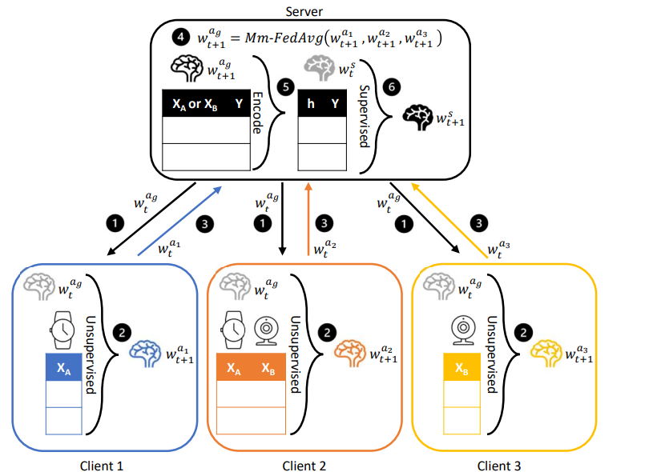

## [Multimodal Federated Learning on IoT Data](https://arxiv.org/abs/2109.04833)

* Yuchen Zhao, Payam Barnaghi, Hamed Haddadi
* Imperial College London
* IoTDI 2022
* Code Not Provided

### Motivation and Problem Formulation

* **Motivation**: Enabling FL system to learn from data of multimodality.
  * Past literiture has shown that training task using multimodality data can improve model performence.
  * Ths paper proposed an method for FL system to use this fact while keep all FL properties (Collabrative training, privacy).
* **Related works**
  * Heterogeneity in federated learning: Clients in FL are often subject to different data Heterogeneity. Unbalance data distribution has been studied extensively in the past but heterogeneity in data modality have not, which is the aim of this paper.
  * Multimodal deep learning: For a certain task, a variety of data modalities can work together to achieve better result. This paper propose a way to use the multimodality in FL setting.
  * Autoencoder: Autoencoders allow data to be mapped from different modalities into highly correlated representations instead of one common representation.
* **Key Challenge:**
  * Device heterogeneity: we have to assume that clients have different data modality, even multiple data modality
  * Not violating FL promises: communicating raw sensing data to server and align data of different modality on server is prohibited.
  * Unlabelled data: Obtain labelled data on clients are unrealistic and is not the case of many FL scenarios.
* **Key Assumption:**
  * Different modality of a multimodal sensors all track same underlying activity.

### Method
* **Proposed solution to aforementioned challenges**
  
  * Instead of train a classifier collabratively, use FL structure train a autoencoder collabratively that can reconstruct different data modality.
  * Given the aforementioned assumption, autoencoder can extract hidden representations for all modalities.
  * Locally trained autoencoder are aggregated with a modified FedAvg.
  * Server keeps a set of labelled unimodality data for training. After a global autoencoder is obtained, labelled data are feed into such autoencoder and reconstructed repersentations are then learned by some neural network to produce the classifier.
  * After each round of training complete, trained classifier and aggregated autoencoder are distributed to all clients. In other words, the preformence of final classifier relay on quality of labelled dataset on server and antoencoder to extract meaningful representation for multimodality data.
* **Autoencoder Architecture**
  
  * In order to work with multimodality, this paper suggested two alternative Autoencoder Architecture, the goal for both is extract and reconstruct meanful representation when input data contain some unknow modality or modalities.
  * Split autoencoder: Objective is to minimize following reconstruction error (assuming system only have 2 data modalities, but expandable), by minimize reconstruction error of both modalities, antoencoder is forced learn to extract representations that are useful for both modalities.
    
    * If input is modality B, fa ga gb are learned instead. If data has both modality, both fa fb are learned.
  * Deep canonically correlated autoencoders (DCCAE): An alternative autoencoder architecture Serves same purpose as split autoencoder to minimize reconstruction loss for all modalities but also uses another objective to increase the canonical correlation between the generated representations from two modalities. DCCAE maps multimodal data into correlated representations rather than shared representations.
* **Multimodality Aggregation for Autoencoder**
  
  * Each modality in autoencoder is corresponding to an encoder and decoder (denote as f and g), after collected all local autoencoders, server conduct a component-wise aggregation similar to FedAvg to produce final autoencoder which is used for subsequent classifier training.

### Evaluations

* Where did they implement their method? On what platform?
* How they evaluate their method?
  * Dataset
  * Baselines
  * Metrics
* What are the key results?

### Pros and Cons (Your thoughts)

* Pros: why you think this is a good paper?
* Cons: unrealistic assumptions, missing elements, missing experiments, etc.